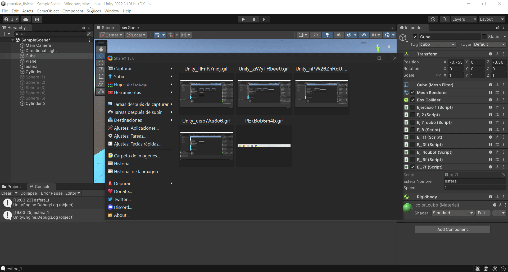

# II_pr3
1)

2)

3 ) 
a ) En el caso de no usar normalize el cubo se mueve mucho mas rápido, si usamos normalize no pasa nada
b ) El cubo se mueve mas rápido a medida que aumentas la velocidad
c ) el cubo se mueve en el sentido contrario
d ) No veo ninguna diferencia si y > 0
f ) Para notar la diferencia entre Space.Self y Space.World tenemos que rotar el cubo para así cambiar sus ejes respecto a los del 
mundo, si rotamos el cubo y aplicamos Space.World se movera relativamente a los ejes del mundo

4-5)

6)

7)

8)

9 / 10 / 11
En el caso del ej 9 solo el cilindro es un rigidbody por lo que cuando colisiona con el cubo hay veces
que detecta la colisión y a veces no. Usamos la función OnCollision para detectar la colisión
En el ej 10 donde el cubo es cinemático y la esfera es un objeto físico siempre detecta la colisión con ambos
En el ej 11 al ser trigger atraviesa el plano por lo que tuve que quitarle la gravedad y el cubo y la esfera
siempre atraviesan el cilindro y tenemos que usar OnTrigger para detectar la colisión.

12)
Cuando la esfera tiene mas masa el cilindro va mucho mas rápido hacia la esfera, y cuando
el cilindro tiene mas masa apenas se mueve. A mayor fricción mas lento se mueve

