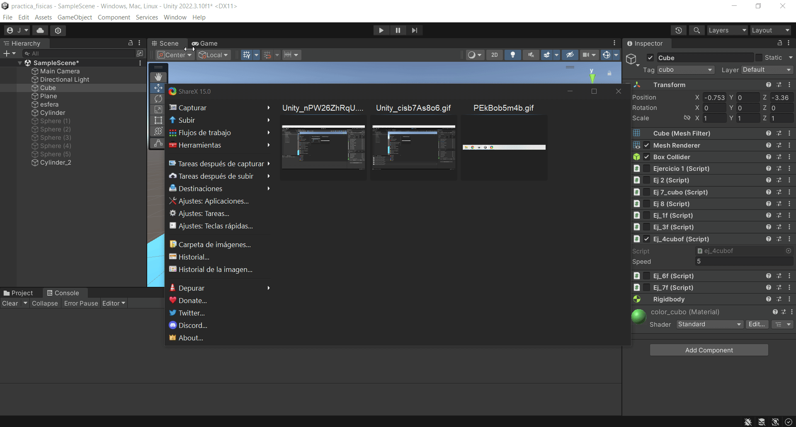

# II_pr3
1)

2)

3 ) 
a ) En el caso de no usar normalize el cubo se mueve mucho mas rápido, si usamos normalize no pasa nada
b ) El cubo se mueve mas rápido a medida que aumentas la velocidad
c ) el cubo se mueve en el sentido contrario
d ) No veo ninguna diferencia si y > 0
f ) Para notar la diferencia entre Space.Self y Space.World tenemos que rotar el cubo para así cambiar sus ejes respecto a los del 
mundo, si rotamos el cubo y aplicamos Space.World se movera relativamente a los ejes del mundo

4-5)

6)

7)

8)

9 / 10 / 11
(describir cada caso)

12)

